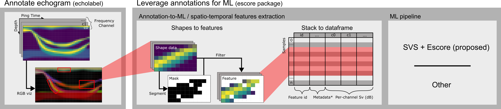
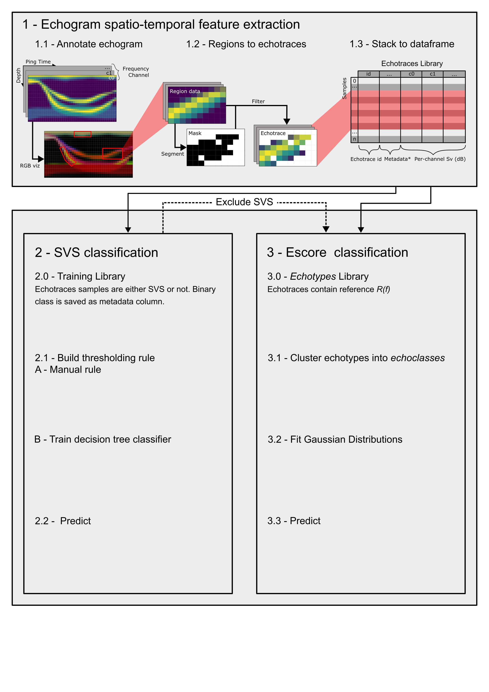

::: {.content-hidden when-format="pdf"}
$$
\DeclareMathOperator*{\argmax}{arg\,max}
$$
:::

# Introduction

Active acoustics is nice

## Key points

We propose a set of open-source modular softwares for supervised echoclassification using traditional ML:

1.  A minimalist echogram annotation tool (using a new standard, Echoregions)
2.  A Jupyter notebook workflow class to post-process annotated regions and format output as ML-ready dataframe
3.  The `escore` Python package containing domain-specific ML tools sub-classing scikit-learn estimators and implementing and extending the Escore method

As a demonstration we apply the Escore method to the ABRAÇOS campaigns data.

# Tools description

::: {#tbl-glossary .list-table aligns="l,l"}
Glossary of terms

-   

    -   Term
    -   Definition

-   

    -    **Manual echogram annotation concepts**

-   

    -   Region
    -   Echogram region delimited by a 2D polygonal shape. In the plural, also designates the corresponding Python representation, or annotation file.

-   

    -   Echogram feature
    -   Any spatio-temporal feature visible on the echogram. *E.g.* shoal, scattering layer, aggregation, internal wave. Such feature is easily spotted by the operator. Extracting it for analysis or modeling is crucial.

-   

    -   Feature Library
    -   A set of echogram features, potentially including metadata such as user-defined class name. Feature libraries are used as training sets for modeling tasks.

-   

    -    **Escore specific terms**

-   

    -   Strong and Variable Scatters (SVS)
    -   Fish-like echoes characterized with very strong $S_v$ values, and important variability within the same aggregation.

-   

    -   Region of Interest (ROI)
    -   "Manually chosen section of the RGB echogram which contains a specific structure of interest with consistent frequency responses" [@annasawmy2024]. An ROI is an Escore-specific *Region*.

-   

    -   Echo-type
    -   Underlying echogram feature contained within an ROI, typically extracted using a KMeans clustering of relative frequeny response.

-   

    -   Echo-class
    -   Grouping of *Echo-types* sharing similar relative frequency response. In the Escore algorithm, echo-class are create using a hierarchical clustering of an echo-types library using mean relative frequency response.
:::

## Echolabel: image-based echogram annotation tool

We propose Echolabel, an open-source minimalist Python application for interactive echogram annotation. The tool is designed to enable polygonal shapes annotation without relying on heavy - and often costly - active acoustics softwares [see @lee2024a for existing softwares].

The design is simple: converting acoustic data into echogram images, and running an image annotation software with a graphical user interface (GUI) to draw shapes on those images. Echolabel wraps LabelMe[^1] (<https://labelme.io/>), is a popular image annotation software designed to build computer vision datasets, which was inspired by the Massachusetts Institute of Technology’s LabelMe web-based interface [@russell2008] and provides an open-source Python implementation with added features.

[^1]: LabelMe runs locally. Its key feature is a GUI built with PyQt5, allowing the user to draw shapes (namely polygons and lines) over the images.

The application is run via a command line interface. Required arguments are source (acoustic data file(s)) and output (annotation file). Echogram visualization options can be specified, including mapped frequency channels and color mapping. Options can be provided as command line arguments or by editing the user’s configuration file, allowing pre-defined setup.

As input acoustic data, Echolabel expects gridded data with time, depth and channel dimensions, as well as an acoustic variable (typically "Sv"). Support is provided by default for the IMOS convention [@kunnath2018] and Echopype products by trying known coordinate names (e.g. for time dimension: "time" and "ping_time"). The former is a *de facto* standard used by many large-scale databases while the latter is the new open-source reference software for acoustic data processing. However, since existing datasets follow varying standards we chose to let the user specify coordinates and variable names in the configuration file. One or more NetCDF files may be loaded if compatible. A Zarr store is also accepted as input.

When launched, the Echolabel reads the source data, chunks it into fixed-width frames, and saves the frames’ metadata. Frames are converted into images by applying a color mapping. Three channels can be rendered simultaneously using an RGB mapping [@ariza2022], providing visual intuition on the organisms’ frequency responses. The Labelme graphical user interface is then launched. As long as the window remains open, the user can add and edit shapes on the dataset’s images. When closing, shapes are converted to (time, depth) coordinates using cached images metadata and the annotation file is (over-)written.

For more details, refer to the online documentation (<https://echolabel.readthedocs.io/>).

Converting echograms to images comes at a cost: losing time and depth label, enforcing a 1:1 aspect ratio for sampled volumes, having no access to the numeric values of pixels. However, many annotation tasks can still be performed efficiently (identifying and delineating aggregations, or finding regions of interest for the Escore algorithm). Besides, image files are much lighter than original data, and their rendering is optimized by LabelMe. This enables fast scrolling through the echogram, and eventually improves user experience and processing speed. A current limitation, however, is LabelMe’s default smoothing behaviour. This blurs the signal at a small scale when zooming and is problematic when looking for the edge of an echogram feature. Echolabel currently deletes shapes that span more than one echogram image. This is an issue when editing annotation files made with a different software or image width.

## Escore: broad-ecosystem semi-supervised thresholding package

### Echogram feature extraction utility

Once a set of echogram regions has been defined and stored as an annotation file, using those within a traditional ML pipeline requires extracting the samples and assembling them as a tabular dataset with one row per sample[^2]. Additionally, because of high pixel-wise variability in acoustic response, delineating echogram features with polygons is often not sufficient to catch the desired signal. Post-processing of regions, for instance using frequency response clustering, can be necessary to extract complex objects or reduce signal variability. Such a treatment requires close supervision by the operator in order to select meaningful data.

[^2]: This is recommended for [scikit-learn](https://scikit-learn.org/stable/data_interoperability.html) pipelines at least.

The `ExtractionWorkflow` class provides a framework and utilities for the post-processing of region data. Parametrized by an acoustic dataset[^3] and the corresponding region annotations (`Regions2D` object), it allows the user to loop through all regions, perform segmentation tasks, and save or reject the result. Built to be used in a Jupyter notebook, the workflow class also enables rich visualization of input and results during processing. Plots include echograms and frequency response statistics, and many made interactive using the hvPlot library.

[^3]: Would be nice to have: (1) optionally time and depth as features (2) simple "None" value for when we do not want to segment (3) segmenter as a more general callable? (currently limited bc. using `.fit_predict`)

The core objective of the workflow is selecting a subset of each region. This is done using a *segmenter*. The segmenter is a classification function taking the region’s channel dimension as features[^4]. While we show the use of custom segmenters such as clustering models in @sec-case-study, the user is allowed to set their own depending on their extraction goals.

[^4]: Would be nice to have: (1) optionally time and depth as features (2) simple "None" value for when we do not want to segment (3) segmenter as a more general callable? (currently limited bc. using `.fit_predict`)

The workflow object stores the segmentation results and recipes (segmentation model, selected segment) as files, enabling full reproducibility of the interactive process. Once the user is satisfied with the processed regions, all samples can be exported as a dataframe for further use in ML pipelines.

### SVS algorithm

Algorithm description (Gary Vargas’ flow chart) Module features.

### Escore model

The Ellipsoïd score (Escore) method is a dB-differencing method introduced by @annasawmy2024. It is a generalization of the Z-score [@derobertis2010] for more than 2 frequencies. The Escore is adapted to the lack of easily separable aggregation and the sparsity of trawling coverage by relying on expert RGB composite echogram scrutinizing rather than ground-truth.

The key idea of the method is analoguous to building an image's *color palette* by selecting reference areas. Instead of colors, the Escore model operates on relative frequency responses (i.e. $\Delta \text{MVBS}$). It lets the user select small regions of the echogram, named *regions of interest* (ROI), each containing a structure of interest with homogeneous frequency response. Selected frequency responses are then extracted, grouped into *echoclasses* and modeled as Gaussian distribution in $\Delta \text{MVBS}$ space. See @annasawmy2024 for a more detailed explanation of the method. Our implementation incorporates adaptations, mostly related to the integration within the scikit-learn framework. Some methodological changes are also applied, mainly to increase interpretability of the model's output;

In a modular approach, the user is left to complete the ROI selection step with the echogram annotation software of their choice, as long as the annotation format can be read as a `Regions2D` object. The `ExtractionWorkflow` can then be used to extract echo-types using a KMeans clustering of $\Delta \text{MVBS}$ as segmenter. Following the Escore nomenclature, the extracted segments are called echo-types.

In a similar manner, grouping can be achieved using the scikit-learn framework. We only provide simple utility functions to inspect and evaluate clustering performance. With regards to the model itself, we propose some changes. To begin with, we dropped step 4, unsure of the additional benefits compared to applying step 5 to all echoclasses.

We designed a custom scikit-learn estimator called `EscoreClassifier`. In a slight change from the original description, we re-interpreted the Escore model as a combination of Gaussian distributions in $\Delta \text{MVBS}$ space, one for each echo-class. Learning this supervised model comes down to learning the parameters of those distributions, i.e. still the echo-classes’ means and covariance matrices. The model can then predict the Mahalanobis distance of a given point $x$ to each distribution. That distance can in turn be used to compute the likelihood of $\mathbb{P}(x|c)$ for any echo-class $c$. This probabilistic formulation adds some interpretability to an otherwise abstract distance measure. One could also want to derive the posterior probabilities $\mathbb{P}(c|x)$, but this is out of this work’s scope.

In addition to learned parameters, our model is also defined by two hyper parameters corresponding to prediction thresholds. The first one is equivalent to the original Escore threshold. It defined the minimal likelihood for prediction. The second one is a quality threshold controlling the maximum acceptable ratio of likelihoods between the best and second best class. This avoids predicting at the boundaries between echo-classes, which might be welcome in some cases.

As a mathematical formulation, we consider a set of echoclasses $C$, and we assume that the conditional probability distribution of each echoclass follows a normal distribution:

$$
\forall c \in C, \mathbb{P}(.|c) \sim \mathcal{N}(\mu_c, \Sigma_c)
$$

Assuming an $n$-dimensional $\Delta \text{MVBS}$ space and $x \in \mathbb{R}^n$, the best and second best echoclass predictions for $x$ can be defined as:

$$
c_1 = \argmax_c{\mathbb{P}(x|c)}
$$

$$
c_2 = \argmax_{c \neq c_1}{\mathbb{P}(x|c)}
$$

Our model is the prediction function $f$ such that:

$$
f(x) = \left\{ \begin{array}{ll}
-1 & : \mathbb{P}(x|c_1) < e_{\text{thresh}} \ \cup \ \mathbb{P}(x|c_2) / \mathbb{P}(x|c_1) >  q_{\text{thresh}} \\
c_1 & : else
\end{array} \right.
$$

where $-1$ is a rejection value returned when the thresholds constraints are violated.

Integrating into the scikit-learn API brings some notable benefits. In particular, this unlocks support for cross validation and a wide range of other machine learning utilities.

### Methodology recommandations

- Acoustic community
- Echo-types selection
  - Quality is hard to assess
  - R(f) + shape criteria
  - An opinionated process: choices should be made explicit
  - Model validity

By design the Escore method is performed in the absence of ground-truth data. This aspect is a strength in context in which little such data exists, as it enables *non-arbitrary classification*[^7] of the echoes. However, this also implies less safeguard in case of the method is poorly executed. In this section, we review the methods objectives, before diving into methodological recommendations related to echo-types selection.

**Acoustic communities**

The goal of the method is to model the relative frequency responses of the *acoustic communities* present in the data. The term refers to the ecological definition of a community , that is a collection of species populations occupying the same space and interacting with one another [@putman1984]. Acoustic communities designates populations whose co-occurrence is detected by active acoustics systems. The term is adapted to highly diverse pelagic environments, where chance is high that a sampled volume contain several backscattering species. Even if a single organism or species were sampled, the acoustic resolution would not be sufficient to classify it at the species level (e.g. ~ XXX swim bladder-bearing mesopelagic fish species were caught during the ABRAÇOS I survey).

*How to define an acoustic community in practice?*

- frequency response
- spatio-temporal extent
- frequency of observation

**Training set definition**

The ROI selected during the first step of the Escore method must contain echo-types representative of the local[^8] acoustic communities. 

*What about picking at random?*

*Existing criteria*

The definition proposed by @annasawmy2024 provides a first selection guideline by specifying two characteristics of the signal within an ROI: a structure of interest and consistent frequency responses. Their implementation enforces those assumptions during echo-types extraction. KMeans clustering of $\Delta \text{MVBS}$ must produce a segment:

1. containing the desired spatio-temporal structure, with little alteration
2. whose relative frequency response is normal for all frequencies (other than the reference frequency)
3. whose relative frequency standard deviation is small for all frequencies (other than the reference frequency)

We find the normality criteria to be too restrictive, in particular when considering small ROIs, such as the 120 kHz crustacean patches.

We propose to allow selection as long as criteria 1 or criteria 2 are respected (criteria 3 remains mandatory).

*Recommendations*

In spite of guideline, ROI selection is subjective. Potential ROIs are numerous and indeterminate. Selecting them is often made using assumptions on what a "good signal" is, and by specifically looking for suspected acoustic communities.

"Good signal" heuristics can include:

1. looking for the "core" or for "clean" frequency response: the operator looks for structure that seem to be less diverse in species, typically during daytime or during diel vertical migration. A potential bias, however, is to look for bright red, green or blue on the RGB echogram. Strong frequency response for one channel is not necessarily associated to a more "pure" sample composition.

We recommend that authors establish a prior typology of echogram features believed to be associated to specific acoustic communities. Such typology should be published as part of the results.

**Model validation**

Visual validation using predicted class masks at the scale of a survey may be somewhat informative. However, it should be noted that all relative frequency response clustering techniques tend to result in "good-looking" masks when comparing to the RGB echogram, no matter how arbitrary the boundaries are. This biased is easy to understand, as the echogram is split according to color[^9].

**Model validity**

Like any ecological community, and especially pelagic ones, acoustic communities are defined in space and time. Hence, the validity of an Escore model is limited to the spatio-temporal range of the modelled communities.

* Spatial variations?
* Temporal variations: long-term, seasonal and most importantly diel.

[^7]: Because in many cases classical $\Delta \text{MVBS}$ clustering methods are.
[^8]: What do we mean by local? (That is the question).
[^9]: Could be more precise. Typical split depends on G-R and B-R.

# Case-study: echoclassification in high diversity context {#sec-case-study}

{fig-align="center" width="100%"}

## Data

Two oceanographic surveys, ABRAÇOS I and ABRAÇOS II, were performed in the Southwest tropical Atlantic in Austral spring 2015 (September 29-October 21) and fall 2017 (April 9-March 8), as part of the project ‘Acoustics along the Brazilian coast’ [@bertrand2015; @bertrand2017]. The study area encompassed the continental shelf and slope off Northeast Brazil, and oceanic waters around the islands and seamounts of the Fernando de Noronha Chain.

Acoustic transects were conducted perpendicularly over the continental slope, and radially around the Rocas Atoll and the Fernando de Noronha Archipelago 1. Acoustic data were collected with a SIMRAD EK60 echosounder at 38, 70, 120 and 200 kHz, synchronously transmitting every 2-3 s. Volume backscattering strength ‘Sv’ (dB re 1 m-1) [@maclennan2002] was recorded down to 700 m depth with a pulse duration of 512 $\mu s$, beam angle of 7°, and a transmit power of 1000, 750 and 200 W at 38, 70 and 120 kHz, respectively. Standard target calibration of the echosounder was conducted prior to data acquisition [@demer2015].

## Notebook 1 - Extracting fish-like echoes: the SVS algorithm {#sec-svs-example}

## Notebook 2 - Mapping echo-classes distribution

:::{#tbl-typology .list-table aligns="c,l,c,c" style="font-size: 70%;"}
Typology of echogram features near the Fernando de Noronha archipelago. *Time of day is relative to the observed diel vertical migration and encoded as D (daytime), N (nighttime) and M (migration at dawn or dusk).

- - Code
  - Description
  - Daytime*
  - Frequency
  - ROIs
  - Echotypes
  
- - Red1
  - Fine epipelagic (20 - 100 m) layer with dominant 38 kHz response. Less marked            frequency response during night. Shaped with frequent upward spikes, or as slender       sublayer.
  - D, N, M
  - ++
  - 26
  - 26
  
- - Green1
  - Fine epipelagic layer with dominant 70 kHz response. Often located below Red1. Hardly     visible during night.
  - D, N, M
  - ++
  - 20
  - 18

- - Blue1
  - Small patches with dominant 120 kHz response, appearing pale blue. Suspected             crustacean hunting aggregations.
  - ?
  - \-
  - 9
  - 8
  
- - Blue2
  - Large layers with overall weak response dominated by the 120 kHz channel, appearing      dark blue. Seems only visible when no other acoustic feature is present. Suspected       crustacean layer. Underlying organisms could be ubiquitous, although masked most of      the time. Caution needed to avoid selecting gain noise near acquisition range limit.
  - D, M
  - \+
  - 13
  - 6
  
- - Fish1
  - Dispersed structures with flat frequency response, visible below and over the top        layer formed by Red1 and Green1 during nighttime. Most probably swim bladder-bearing      fish.
  - D
  - ++
  - 7
  - 6
  
- - Fish2
  - Well defined layer aggregations mostly during migration or at night. Flat frequency     response, with localized shift toward 38 kHz, potentially associated to tilt angle       (selected ROIs containing either frequency response). Believed to be swim                bladder-bearing fish.
  - D, N, M
  - ++
  - 6
  - 6

- - Red2
  - Weak layer occurring below Green1  or around 200 m during daytime. 38 kHz dominated.
  - D, M
  - \+
  - 11
  - 11
  
- - Beige1
  - Mesopelagic layer sometimes visible during day. 38 kHz dominated but appear brownish     or beige due to a weak 70 kHz response. Possible mix involving Red2.
  - D
  - \*
  - 4
  - 4
  
- - DeepGreen
  - 
  -
  -
  - 2
  - 2
  
:::

The Escore method is performed on samples contained within a 60 nm radius from the Fernando de Noronha atoll.

The Escore method is performed on the ABRAÇOS II dataset only because of significant seasonal variations in the acoustic seascapes [@ariza2022]. Indeed, some level of homogeneity is required to allow the model to account for changes in the dominant echo-classes with space and time. Conversely, day-time and night-time are simultaneously processed in spite of large differences. This is because some echo-classes (*e.g.* crustaceans-dominated) are only visible at day-time, and masked at night due to a weak acoustic response. On the other hand, some other are out of range during the day. Finally, while migrations might appear to solve the issue, change in the mean tilt angle of organism makes them poorly suited to be the only reference for frequency response.[^5]

[^5]: Should be interesting to perform Escore separately for each fPCA seascape. Maybe for the example, just in ABRAÇOS II pelagic + separate dawn, day, dusk, night. This can be done very easily after ROI selection. It also increases the chances of having a clustered structure in $\Delta \text{MVBS}$ space.

The 200 kHz channel is not used in the analysis because of its limited depth range (180 m), constraining classification to the epipelagic zone.

The SVS rule induced in @sec-svs-example is applied to the dataset, and detected SVS are masked out prior to Escore analysis.

188 ROIs have been selected accross the whole echogram, either at day- or night-time. Criteria for ROI selection were related to the frequency responde homegeneity and relevance of the features within. While the latter is highly subjective, peculiar attention was paid to frequently observed features (*e.g.* day-time scattering layer) or, conversely, to potentially rare but well-defined aggregations (*e.g.* 120 kHz-dominated "patches" known to be associated to crustaceans).

Selected ROIs, are processed using the `ExtractionWorkflow`. 160 (85 %) are converted into echo-types while 28 are rejected.

**Extraction notes**

Extraction of echotypes with flat frequency responses tend to be difficult when clustering $\Delta \text{MVBS}$, probably because of a large distribution of the features: the ROIs are contained in an homegeneous seascape, and clustering just separates signals that are already similar. In such cases (typically for Fish1 and Fish2) we apply a clustering on $\text{MVBS}$ directly, basically dropping the low intensity samples. (also applies to some Red2).

Some extraction are better done by changing the reference frequency in $\Delta \text{MVBS}$ computation (e.g. to 70 kHz for Green1 by day)

One Green1 actually a Fish1 (around beginning/middle)
One Red1 actually a Green1 (around end)

For Blue1: sometimes use thresholding on 120 kHz (e.g. $\text{MVBS}_{120} \geq -67 \ \text{to} -72 \ \text{dB}$)

For Blue2: sometimes quite indulgent on the extraction criteria: no real structure to see + distribution is hardly normal. But relative frequency response is very strong in 120 kHz, with inter-freq variations >> variances.

---

Frist seamount: new classes.
Green surface: algae
Maybe take more blues
Take some more: > 10 per user class

Test: remove seamounts
3D curtain plot of classif

# Development practices

- Open-source (GitHub...)
- Modular design ()
- Interoperability and integration in the scientific Python ecosystem (Data compatibility, Echoregions)
- Reproducibility

Echolabel relies on Echoregions (<https://github.com/echostack-org/echoregions>) to represent and parse polygonal echogram annotations. Echoregions is an interfacing package designed to represent acoustic data shapes annotations in Python and easily plug into machine learning (ML) pipelines. It is part of the Echostack suite [@lee2024]. While still in development, it presents some key features which motivated using it to handle Echolabel’s annotations input-output, among which parsing and saving annotations in EchoView’s EVR file formats in addition to CSV files. This feature enables Echolabel’s output files to be converted to EVR format easily. Further development of Echoregions should extend compatibility to other echogram annotation formats [@lee2024].

Another functionality is converting annotations to machine learning ready masks (annotation to ML) and generating annotation from ML predictions (ML to annotation). Annotation to ML is the primary use case of Echolabel.

# Future directions

# Conclusion

## References {.unnumbered}

::: {#refs}
:::
